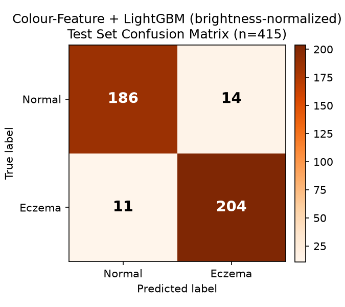

# Can Brightness Normalization Fix the Eczema/Normal Shortcut-Learning Issue?

## Question being tested

The previous usability check (`docs/dataset_usability_check_2026-08-26.md`) quantified
the known shortcut: mean overall brightness (`MEAN_XYZ_2`) differs ~4x between classes
(Eczema 0.15 vs. Normal 0.58), and it was the single most important feature for the
colour-features + LightGBM model. Natural question: **if the images are re-normalized to
remove that brightness difference, does the ~95% accuracy go away?** If yes, brightness
correction alone might be a viable, cheap fix. If no, the confound runs deeper than
exposure and a preprocessing fix won't be enough.

## Method

1. **`scripts/extract_color_features_normalized.py`** — for every image, before any
   colour-space math, each RGB channel is independently rescaled to a fixed target mean
   (0.5) and standard deviation (0.15) across the whole image (a per-image exposure/
   contrast normalization — sometimes called a form of colour/brightness standardization).
   This forces `MEAN_RGB_x` / `STD_RGB_x` to be identical (by construction) for every
   image regardless of source, and recomputes the same 90 colour features used before on
   top of the normalized pixels. Output: `dataset/color_features_normalized.csv`.
2. Verified the normalization actually worked before trusting anything downstream:
   `MEAN_XYZ_2` went from 0.15 vs. 0.58 (Eczema vs. Normal) to **0.2612 vs. 0.2605** —
   essentially identical, confirming the brightness signal used by the original model no
   longer exists in this version of the data.
3. **`scripts/train_stage_b_lightgbm_normalized.py`** — retrained the exact same LightGBM
   setup on the normalized features, using the identical train/val/test split, so this is
   a controlled A/B comparison against the original 95.18% test accuracy.

## Result: accuracy barely moved

| Metric | Original colour features | Brightness-normalized |
|---|---|---|
| Test accuracy | 95.18% | **93.98%** |
| Precision (Eczema) | 93.72% | 93.58% |
| Recall (Eczema) | 97.21% | 94.88% |
| F1 (Eczema) | 95.43% | 94.23% |

Confusion matrix, normalized model, test set:

| | Predicted Normal | Predicted Eczema |
|---|---|---|
| **True Normal** | 186 (TN) | 14 (FP) |
| **True Eczema** | 11 (FN) | 204 (TP) |

Removing the entire brightness/exposure signal only cost about **1.2 percentage points**
of accuracy. The classes are still almost perfectly separable.

## What the model leans on instead

New top features by gain: `STD_HSV_1` (saturation variability), `STD_LCH_2` (hue
variability in CIE-LCH), `STD_HSV_2`, `STD_RGB_2` (blue-channel variability). Checked
directly: `STD_HSV_1` (how much saturation varies across the image) is **0.058 for
Eczema vs. 0.136 for Normal** — more than double. That's consistent with what the two
classes actually are: Normal images are stock photos (varied scenes — skin, clothing,
backgrounds, multiple colours), while Eczema images are close-up clinical crops of skin
only (much more visually uniform, plus the dark background and any DermNet watermark).
That's a **composition/source difference, not an exposure difference** — a lighting fix
can't touch it.

## Answer to "can altering brightness fix this?"

**No, not on its own.** This was worth testing directly rather than assuming, and the
result is a genuinely useful negative finding for the paper: it rules out "it's just a
lighting/exposure problem" and confirms the issue is structural — two different
photography *styles* (subject framing, background, colour palette, camera/compression
characteristics), not a fixable global brightness offset. This actually strengthens the
original diagnosis in `Progress_Log_2026-08-26.docx` §3.4/§8, since it shows the shortcut
survives a targeted attempt to remove one of its two top contributing features.

What would still need to happen (unchanged from the earlier recommendation, now with
more direct evidence behind it):

- **Crop both classes to skin/lesion-only regions** with consistent framing, so
  background and composition can't be used as a cue — likely the single highest-leverage
  fix, since it directly targets what the saturation-variability features above are
  picking up on.
- **Remove or exclude DermNet-watermarked Eczema images.**
- **Re-source the Normal class** from the same kind of clinical/dermatology-atlas
  imagery used for Eczema, rather than stock photography, so both classes share a
  capture pipeline (camera, lighting protocol, framing) — this is what Maulana et al.
  (2024) had by design, and is why their reported 93–95% is trustworthy while this
  project's current number, even after brightness correction, is not yet.
- A local (per-region) colour/contrast normalization applied *after* cropping to a
  consistent skin patch might be worth revisiting once framing/background are no longer
  confounds — but doing it on full, differently-composed images (as tested here) isn't
  enough by itself.

## Artifacts produced

- `dataset/color_features_normalized.csv`
- `models/stage_b_lightgbm_normalized.txt`
- `docs/stage_b_normalized_lightgbm_confusion_matrix.png`
- Scripts: `scripts/extract_color_features_normalized.py`,
  `scripts/train_stage_b_lightgbm_normalized.py`,
  `scripts/make_confusion_matrix_lgbm_normalized.py`

No original files were modified — this is a parallel experiment. `manifest_*.csv`,
`color_features.csv`, and the original models are untouched.
