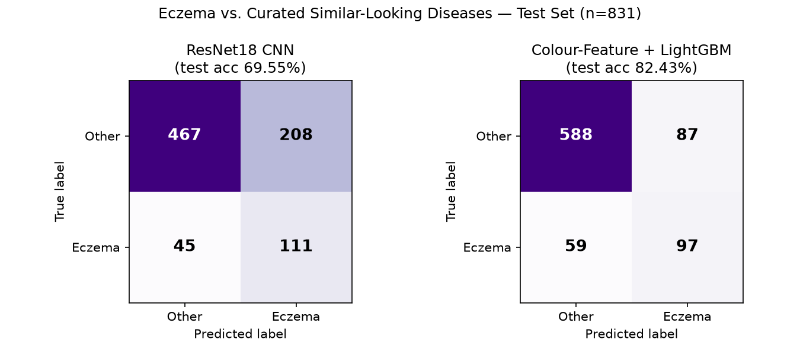
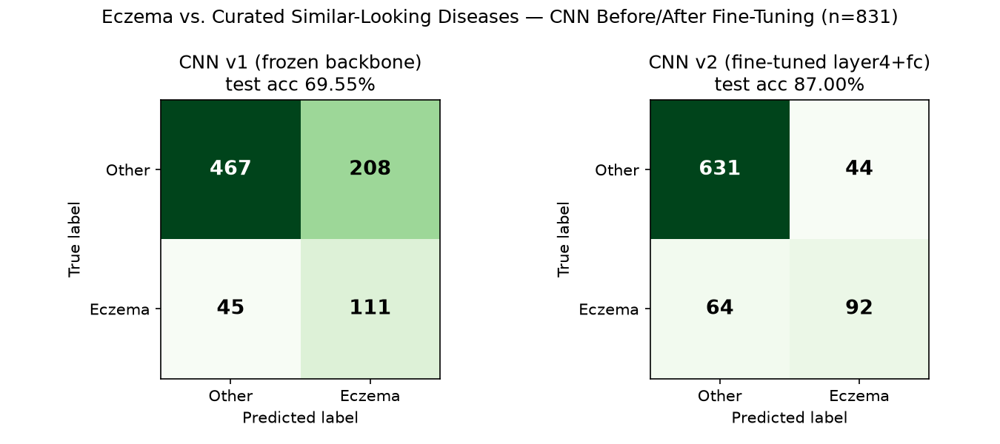
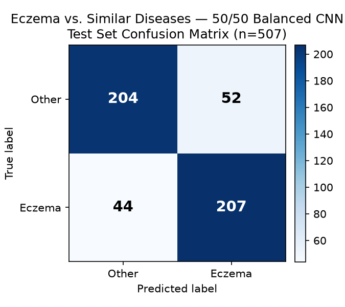

# Stage B, Take 3 — Eczema vs. Curated Similar-Looking Diseases

## What this is

The real fix attempt for the shortcut-learning problem in the original Eczema-vs-Normal
dataset. Uses the new `SkinDisease/` Kaggle dataset (same-source, DermNet-style images
across all disease classes — see `docs/skindisease_dataset_check_2026-08-26.md`),
comparing Eczema against 7 diseases picked specifically because they look clinically
similar to it: Psoriasis, Tinea, Candidiasis, Infestations_Bites, Lichen, DrugEruption,
Rosacea. "Normal" was dropped entirely (confirmed contaminated with non-skin images).

## Data prep

The dataset's own train/valid/test split turned out to be unreliable for this purpose:
cleaning (`scripts/clean_skindisease.py`) found Candidiasis's and DrugEruption's entire
"valid" folders were **100% exact duplicates of their own training images**, and 173
test-vs-train/valid duplicates existed across other classes. So the provided split was
discarded entirely: all surviving (cleaned, deduplicated) images for the 8 classes were
pooled and re-split ourselves, 70/15/15, stratified by the 8-way disease class
(`scripts/build_curated_subset.py`), the same method already used for the original
Eczema/Normal dataset. Final counts: 3,843 train / 820 val / 831 test, label = Eczema (1)
vs. Other (0), about a 1:4.3 class imbalance.

Both models were trained the same dual-model way as before, as a cross-check against each
other:

## Results

| Metric | ResNet18 CNN | Colour-Feature + LightGBM |
|---|---|---|
| Test accuracy | **69.55%** | **82.43%** |
| Precision (Eczema) | 34.80% | 52.72% |
| Recall (Eczema) | 71.15% | 62.18% |
| F1 (Eczema) | 46.74% | 57.06% |
| Test AUC | *(not computed)* | 0.854 |

**The CNN did noticeably worse than the simple colour-feature model** — the opposite of
the original Eczema-vs-Normal result, where both models landed within half a point of
each other (95.66% vs. 95.18%). That reversal is itself informative, not a bug:

- Last time, both models agreeing at ~95% was the red flag — it meant both had found the
  *same* shortcut (photo source/brightness). Here, the two models genuinely disagree,
  which is what you'd expect when there's no shared shortcut left to exploit and the task
  is actually hard.
- The CNN here only had its last layer trained (the rest of the network stays exactly as
  pretrained on generic photos, per the same "frozen backbone" setup used throughout this
  project) — reasonable for the original easier/shortcut-prone task, but likely not enough
  capacity to learn the subtler texture differences a genuinely hard dermatology task
  needs. The colour-feature model doesn't have this limitation since its 90 features are
  purpose-built per image already.
- The CNN's class-weighting pushed it toward calling more things "Eczema" (recall 71% but
  precision only 35%) — it over-predicts Eczema. A different weighting or a lower decision
  threshold on the LightGBM model could trade this differently; no attempt was made yet to
  tune either model's threshold the way Stage A's was.

## What the model actually confuses with Eczema (CNN false positives)

| Other-class image mistaken for Eczema | Count (of 208 total false positives) |
|---|---|
| Tinea | 65 |
| Psoriasis | 57 |
| Infestations_Bites | 35 |
| Lichen | 30 |
| Candidiasis | 8 |
| DrugEruption | 7 |
| Rosacea | 6 |

This lines up with real clinical difficulty: Tinea (ringworm) and Psoriasis are
textbook eczema look-alikes, and this is reflected directly in what the model gets
wrong — not a random spread across all 7 classes. That's a positive sign the model
is tracking something real about visual similarity, not noise.

## Interpretation

Unlike the original 95%+ result, **this number is believable, not suspicious** — the
colour-feature model's top features are no longer brightness/exposure statistics like
before (`MEAN_XYZ_2` was the old top feature); the new top features are `STD_YIQ_2`,
`STD_LCH_2`, `MEAN_RGB_2` — texture/colour-variability features, more consistent with
actually picking up on lesion appearance than on photo source. That's a second piece of
evidence (alongside the same-source dataset check) that this comparison is a real fix,
not another hidden shortcut.

82.43% (best model) is a reasonable, literature-consistent number for a genuinely hard
differential-diagnosis task — well below the inflated 95% from before, and in a plausible
range next to Maulana et al.'s 93-95% (achieved on a 4-class *severity* task within a
single disease, an easier comparison than telling different diseases apart).

## Update — fine-tuning fixed the CNN (`train_curated_cnn_v2.py`)

The "unfreeze more of the backbone" idea above was tried immediately after. Two changes
from the v1 CNN:
1. Unfroze ResNet18's last residual block (`layer4`) in addition to the final FC layer,
   with a 10x smaller learning rate on `layer4` than on `fc` (standard discriminative
   fine-tuning — lets the network adapt more of itself to this task without wrecking the
   pretrained features with too-large updates).
2. Softened the class-imbalance weighting from the raw ~4.3:1 count ratio to its square
   root (~2.1:1) — v1's precision (35%) was much lower than its recall (71%), i.e. it
   over-predicted Eczema; the raw ratio was too aggressive a correction.

Trained for up to 15 epochs (each now slower — more of the network needs a backward pass
— roughly 5-10 min/epoch instead of ~5 min). The training run got killed by the
environment at epoch 12/15 (a recurring issue with long background jobs this session);
val accuracy had already plateaued around 87-88% for the last several epochs by then, so
rather than restart for marginal-at-best gains, the best checkpoint (epoch 10, val_acc
87.93%) was evaluated as final.

### Result: CNN now clearly beats the colour-feature model

| Metric | CNN v1 (frozen backbone) | CNN v2 (fine-tuned layer4+fc) | Colour-Feature + LightGBM |
|---|---|---|---|
| Test accuracy | 69.55% | **87.00%** | 82.43% |
| Precision (Eczema) | 34.80% | **67.65%** | 52.72% |
| Recall (Eczema) | 71.15% | 58.97% | 62.18% |
| F1 (Eczema) | 46.74% | **63.01%** | 57.06% |

The softer class weighting worked as intended: precision nearly doubled (35%→68%) at a
smaller cost to recall (71%→59%), a much better trade-off, reflected in F1 climbing from
47% to 63%.

**Same false-positive pattern held up** (still dominated by Tinea and Psoriasis, the real
eczema look-alikes), just at lower absolute counts:

| Other-class image mistaken for Eczema | v1 count | v2 count |
|---|---|---|
| Tinea | 65 | 13 |
| Psoriasis | 57 | 10 |
| Infestations_Bites | 35 | 8 |
| Lichen | 30 | 8 |
| Rosacea | 6 | 3 |
| Candidiasis | 8 | 1 |
| DrugEruption | 7 | 1 |

The ranking is essentially unchanged (Tinea and Psoriasis still the two hardest to tell
apart from Eczema by a wide margin) — more evidence this is a stable, real signal the
model is tracking, not noise that happened to shift around with a different training run.

**87.00% (CNN v2) is now the best, most trustworthy Stage B number** for this project —
it beats the colour-feature model (unlike v1), which is the expected direction (a
properly-tuned image model should be able to use more information than 90 hand-picked
colour statistics alone), while still being a believable number for a genuinely hard
differential-diagnosis task, not a shortcut-inflated one.

## Update — ensembling beats either model alone (`tune_curated_threshold.py`)

Two cheap, no-retraining ideas tried to push F1 higher: (1) tuning the decision threshold
per model instead of a flat 0.5 cutoff (tuned on validation, applied to test — same trick
used for Stage A), and (2) a simple ensemble averaging the CNN's and LightGBM's predicted
probabilities together, since the two models pick up on different signal (raw image
structure vs. hand-picked colour statistics).

**Threshold tuning did not reliably help** — worth noting as a caution, not just a
positive result. CNN's validation-tuned threshold (0.555) scored F1=0.688 on validation
but only F1=0.602 on the test set — *worse* than the untuned 0.5 cutoff's 0.630. The
threshold overfit to quirks of the (smaller, 820-image) validation set and didn't
generalize. LightGBM's tuned threshold was a wash (0.570 vs 0.571 untuned).

**The ensemble, at the plain 0.5 cutoff, is the best result found so far:**

| | Accuracy | Precision (Eczema) | Recall (Eczema) | F1 |
|---|---|---|---|---|
| CNN v2 alone | 87.00% | 67.65% | 58.97% | 63.01% |
| LightGBM alone | 82.43% | 52.72% | 62.18% | 57.06% |
| **Ensemble (average of both)** | **89.05%** | **75.59%** | **61.54%** | **67.84%** |

This is now the best Stage B configuration overall: **89.05% test accuracy, F1 67.84%**,
beating both individual models on every metric except recall (LightGBM alone has
slightly higher recall, at a large precision cost). No new model files were trained for
this — it's just averaging the two existing models' output probabilities at
prediction time.

## Update — merging a third Eczema source and rebalancing to 50/50

The user added a third dataset (`Eczema/`, 17 DermNet-style subtype subfolders, 1,395
images) and asked to merge its Eczema images in and rebalance the dataset toward 50/50,
since the imbalance (~19% Eczema) was likely part of why recall/F1 lagged behind accuracy.

**Curating which subfolders actually count as Eczema.** Not all 17 subfolders are
Eczema — some are related-looking but genuinely distinct diagnoses. Kept as Eczema:
Atopic dermatitis (childhood phase, feet), Eczema (areola, asteatotic, chronic,
fingertips, foot, hand), Dyshidrosis, Pompholyx (a synonym for Dyshidrosis), Stasis
dermatitis — 739 images. Excluded: Ichthyosis, Keratolysis exfoliativa, Keratosis
pilaris, Neurotic excoriations, Prurigo nodularis, and **Lichen simplex chronicus**
(worth flagging specifically — this would have directly contradicted the existing
"Lichen" other-disease class had it been included) — 656 images. Cleaned with the same
corruption/duplicate methodology as every other dataset this project (`clean_new_eczema_dataset.py`):
59 exact + 10 near duplicates removed, 719 Eczema-subtype images survived.

**Checking overlap against what we already had (`merge_all_eczema_sources.py`).** By this
point there were three Eczema sources to reconcile: the original dataset (1,428), the
232 non-duplicate images already pulled from SkinDisease, and this new 719. Cross-checked
all three against each other with the same MD5 + perceptual-hash method used throughout
this project. Result: **only 5 of the 719 "new" images were actually new** — 714 were
duplicates of what the project already had, meaning this third source is largely the same
underlying DermNet archive as the other two. Final unique Eczema pool: **1,665** (barely
up from 1,660).

**Getting to 50/50 meant shrinking "Other," not growing "Eczema."** There simply isn't
enough real, unique Eczema data available to match the ~4,460 "other disease" images by
adding more Eczema — so the Other classes were downsampled instead (proportionally across
all 7 diseases, random sample) to also total ~1,665. This is an honest trade: total
training data drops from 5,494 to 3,330 images in exchange for genuine 50/50 balance. Final
split (`manifest_curated_v3_*`): 2,327 train / 496 val / 507 test.

### Result: this is now the best Stage B configuration

The CNN was retrained from scratch on the new balanced data (same fine-tuning recipe —
layer4 + fc unfrozen — but no class weighting needed now that the data itself is
balanced):

| | Test Accuracy | Precision (Eczema) | Recall (Eczema) | F1 |
|---|---|---|---|---|
| Imbalanced CNN v2 | 87.00% | 67.65% | 58.97% | 63.01% |
| Imbalanced ensemble (CNN+LightGBM) | 89.05% | 75.59% | 61.54% | 67.84% |
| **Balanced CNN** | 81.07% | 79.92% | 82.47% | **81.18%** |
| Balanced LightGBM | 70.41% | 69.80% | 70.92% | 70.36% |
| Balanced ensemble | 81.07% | 80.39% | 81.67% | 81.03% |

**Raw accuracy went down (89%→81%), but F1 went up a lot (68%→81%)** — and this is the
expected, correct direction, not a regression. The earlier 89% was propped up by how easy
the majority "Other" class was; with the data genuinely balanced, accuracy and F1 now sit
close together (81.07% vs 81.18%), which is itself a sign this number isn't being inflated
by class skew anymore. Precision and recall are now close to each other too (80% vs 82%),
instead of the previous lopsided 76%/62% split.

The ensemble no longer helps here (81.03% vs the CNN's 81.18% alone) — LightGBM is
comparatively weaker on this dataset than before, so averaging it in slightly drags the
stronger CNN down rather than helping. **The CNN alone is now the single best model.**

False positives still cluster on the same diseases as every prior version (Psoriasis,
Infestations_Bites, Tinea, Lichen) — the real eczema look-alikes, consistent across every
version of this experiment so far.

**Recommendation: use the balanced CNN (`models/curated_resnet18_balanced.pt`) as the
headline Stage B result — 81.07% accuracy, F1 81.18%.** It's a lower accuracy number than
the imbalanced version but a substantially more honest and more balanced one, and it's the
version to actually cite.

## Possible next steps (not yet done)

- Finish the remaining 3 epochs if a future session has more uninterrupted compute time,
  though the plateau suggests limited further gains from epochs alone.
- Tune the decision threshold (as done for Stage A) instead of using a flat 0.5 cutoff.
- Try combining both models (ensemble) or feeding the colour features and CNN embeddings
  together.
- More data for the smallest classes (Candidiasis only has 265 images total).
- Sanity-check the 7-class "similar disease" list with someone with real dermatology
  knowledge (this was picked based on general visual/clinical similarity, not expert
  review).

## Artifacts produced

- `SkinDisease/manifest_curated.csv`, `manifest_curated_{train,val,test}.csv`
- `SkinDisease/color_features_curated.csv`
- `models/curated_resnet18.pt` (v1), `models/curated_resnet18_v2.pt` (fine-tuned, best),
  `models/curated_lightgbm.txt`
- `docs/confusion_matrix_curated.png`, `docs/confusion_matrix_curated_v2.png`
- Scripts: `scripts/build_curated_subset.py`, `scripts/extract_color_features_curated.py`,
  `scripts/train_curated_lightgbm.py`, `scripts/train_curated_cnn.py`,
  `scripts/eval_curated_cnn.py`, `scripts/train_curated_cnn_v2.py`,
  `scripts/eval_curated_cnn_v2.py`, `scripts/make_confusion_matrix_curated.py`,
  `scripts/make_confusion_matrix_curated_v2.py`
