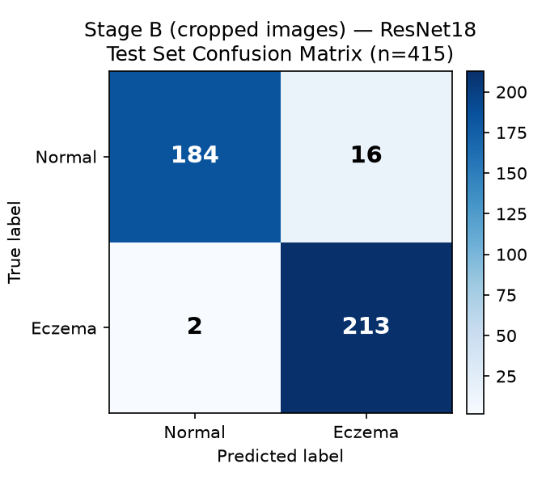

# Auto-Cropping the Eczema/Normal Images — Method and Result

## Goal

Test whether cropping both classes down to the skin/lesion region (removing background
and composition, one of the two confounds identified alongside brightness — see
`docs/brightness_normalization_experiment_2026-08-26.md`) fixes the shortcut-learning
problem, and retrain both Stage B models on the result.

## Method

**`scripts/crop_images.py`** — no manual bounding-box annotations exist for this dataset
and no offline pretrained segmentation model was available, so this uses a standard
heuristic: YCbCr skin-colour thresholding (Chai & Ngan, 1999) to build a skin mask,
connected-component analysis to find the largest blob, then crop to its bounding box
with a 10% margin. Applied identically to both classes.

**QC caught a real bug before trusting the output.** The first version picked the
*largest* connected skin-toned blob regardless of position. Spot-checking samples (this
project's established practice — see `Progress_Log_2026-08-26.docx` §3.4) turned up a
bad case immediately: a stock photo of a woman's face reflected in a mirror, where the
crop grabbed a blurred, out-of-focus foreground shoulder instead of the actual face —
because a smooth blurred patch is often a bigger uniform blob than a face broken up by
eyes/hair/mouth. Fixed by weighting each candidate blob by both size *and* distance from
image center (subjects are usually roughly centered in both the clinical and stock
photos here). Re-verified on the same image plus five more across different Normal
sub-sources (stock portraits, hand photos) and both Eczema examples — all correctly
centered on the actual subject after the fix. Full crop stats: **2,731/2,757 (99.1%)
images cropped; 26 Eczema images fell back to the uncropped original** (no confident
skin region found — plausible for very red/inflamed or unusually lit close-ups; 0
fallbacks on Normal).

Both Stage B models were then retrained on the cropped images, same train/val/test split
membership as before (`manifest_cropped_{train,val,test}.csv`, same underlying photos):
- `scripts/train_stage_b_cropped.py` / `eval_stage_b_cropped.py` — ResNet18 CNN, identical
  hyperparameters to the original.
- `scripts/extract_color_features_cropped.py` / `train_stage_b_lightgbm_cropped.py` —
  same 90 colour features, same LightGBM setup.

## Result: no improvement — the shortcut survives cropping too

| Metric | Original | Brightness-normalized | **Cropped** |
|---|---|---|---|
| CNN test accuracy | 95.66% | *(not tested)* | **95.66%** |
| LightGBM test accuracy | 95.18% | 93.98% | **95.42%** |

The CNN's test accuracy is **identical to three significant figures** (95.66% both —
same 415-image test set, TN/FP/FN/TP shifted slightly: 184/16/2/213 vs. the original
183/17/1/214, essentially noise). The LightGBM model actually went up slightly, not down.

CNN confusion matrix, cropped images, test set:

| | Predicted Normal | Predicted Eczema |
|---|---|---|
| **True Normal** | 184 (TN) | 16 (FP) |
| **True Eczema** | 2 (FN) | 213 (TP) |

**More tellingly: brightness didn't move either.** Measured directly on the cropped
images' colour features: `MEAN_XYZ_2` (overall brightness) is **0.154 (Eczema) vs. 0.494
(Normal)** — essentially the same 3-4x gap as the uncropped images (0.15 vs. 0.58), and
`MEAN_XYZ_2` is *still* LightGBM's single most important feature (gain 11,262, even
higher than the original 13,609's relative share). Cropping to the skin region doesn't
touch camera/lighting/sensor differences between the two photo sources — it only removes
what's *around* the skin, not how the skin itself was captured.

## Interpretation

Between this experiment and the brightness-normalization one, **both of the two "cheap
fix" hypotheses have now been tested and ruled out**:

- Brightness/exposure correction alone: barely moved accuracy (95.18% → 93.98%).
- Background/composition removal alone: didn't move accuracy at all (95.18% → 95.42%;
  95.66% → 95.66%).

This is a stronger and more useful negative result than either alone. It means the
confound isn't reducible to "the background is different" or "the exposure is
different" — it's baked into the entire image-capture pipeline (camera sensor,
compression, lighting rig, colour grading) for the skin region itself, which persists
however the frame is cropped or the histogram is corrected. Cropped Eczema images still
carry visible DermNet watermarks in spot-checked samples (cropping doesn't remove
overlaid text), and the two classes remain drawn from fundamentally different sources
across their entire pixel content, not just their framing.

**This raises, rather than lowers, the bar for a real fix.** The recommendation from
`Progress_Log_2026-08-26.docx` §7.1 and both prior experiments stands and is now better
evidenced: same-source imagery for both classes (ideally the same camera/protocol, as in
Maulana et al. 2024) is the prerequisite, not cropping or colour correction as
preprocessing steps on the current mismatched sources.

## What this doesn't mean

The cropped models aren't "wrong" or unusable as pipeline artifacts — they demonstrate
the same training/eval code works on cropped input, which is useful if same-source
imagery is obtained later (crop it too, for consistent framing). What it rules out is
using cropping *by itself*, on the current dataset, as a fix for the accuracy numbers
being trustworthy.

## Artifacts produced

- `dataset/cropped/{Eczema,Normal}/` — cropped images
- `dataset/manifest_cropped.csv`, `manifest_cropped_{train,val,test}.csv`
- `dataset/color_features_cropped.csv`
- `models/stage_b_resnet18_cropped.pt`, `models/stage_b_lightgbm_cropped.txt`
- `docs/stage_b_cropped_cnn_confusion_matrix.png`, `docs/stage_b_cropped_lightgbm_confusion_matrix.png`
- Scripts: `scripts/crop_images.py`, `scripts/train_stage_b_cropped.py`,
  `scripts/eval_stage_b_cropped.py`, `scripts/extract_color_features_cropped.py`,
  `scripts/train_stage_b_lightgbm_cropped.py`, `scripts/make_confusion_matrix_cropped.py`,
  `scripts/make_confusion_matrix_lgbm_cropped.py`

No original files were modified.
